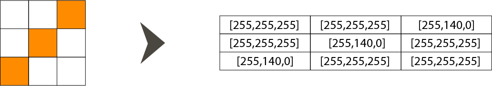
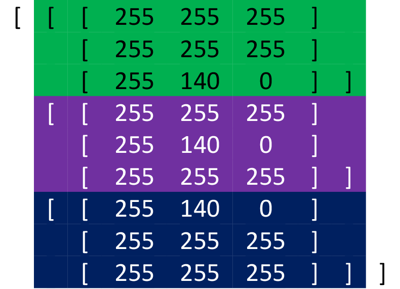
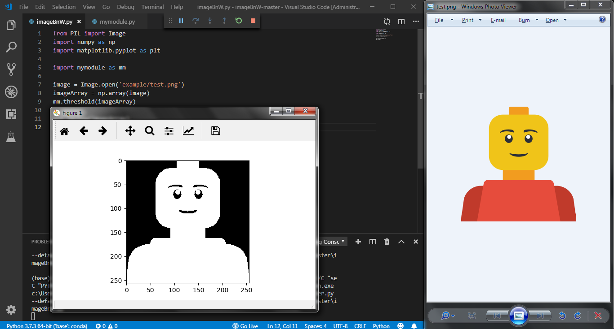

# What is pixel?

A pixel is the smallest unit of a digital image or graphic that can be displayed and represented on a digital display device. A pixel is represented by a dot or square on a computer monitor display screen. Pixels are the basic building blocks of a digital image or display and are created using geometric coordinates. Depending on the graphics card and display monitor, the quantity, size and color combination of pixels varies and is measured in terms of the display resolution.

For example, a computer with a display resolution of 17 x 17 will produce a maximum of 289 pixels on a display screen. Each pixel has a unique logical address, a size of eight bits or more. Let's consider that each pixel (square) has its RGB (Red-Green-Blue) value respectively.
<p align="center"> 

</p>
For the picture above, as it is said, each pixel has its own red, green, and blue value. Thus, for example, a pixel that is black can be represented as a list of values of red, green and blue, respectively. That is, [0,0,0] such a black pixel record.

# How this script recognizes pixel values?

Let's look at the picture as a 3 x 3 matrix, where each field represents one pixel.

Grouping pixels along the line one below the other, line by line, the appearance of the list is obtained, on the basis of which further image processing is performed.

Green - the first line <br>
Purple - second line <br>
Dark blue - third line
<p align="center">

</p>
<p align="center">
</p>

## Commenting the code

Now we're ready to dig into what makes an image in numbers. For this, we use PIL or Pillow.


```python
from PIL import Image
import numpy as np
import matplotlib.pyplot as plt

import mymodule as mm
```

As you can see, there is a library called mymodule. There is a mechanism under which the image is converted to a deep, black-and-white image


```python
def threshold(imgArray):
    arrayOfAverageNumber = []
    newArray = imgArray
    for eachRow in imgArray:
        for eachPixel in eachRow:
            averageNumber = np.mean(eachPixel[:3])
            arrayOfAverageNumber.append(averageNumber)
    balance = np.mean(arrayOfAverageNumber)

    for eachRow in newArray:
        for eachPixel in eachRow:
            if np.mean(eachPixel[:3]) > balance:
                eachPixel[0] = 255
                eachPixel[1] = 255
                eachPixel[2] = 255
                eachPixel[3] = 255
            else:
                eachPixel[0] = 0
                eachPixel[1] = 0
                eachPixel[2] = 0
                eachPixel[3] = 255
    return newArray
```

Moving through each row in the imgArray and each pixel in a eachRow, the mean value of each pixel is calculated individually and is placed in a previously created empty list called arrayOfAverageNumber. By looking at the mean value of such a list, a full-scale balance is obtained.

Now, when there is a balance of the image, it is again going through every line in newArray and every pixel separately, in the eachRow.
By checking that the mean value of the current pixel is greater than the value of the entire image balance, the values of the red, green and blue colors of the current pixel are set to 255, otherwise 0.

It remains to be commented on a portion of the master code in which the threshold function from the mymetode will be called.


```python
image = Image.open('example/test.png')
imageArray = np.array(image)
mm.threshold(imageArray)
```

In the first line, the picture opens and as it is said, that's what turns the picture into numbers.
Using np.array(image), an image record was obtained, which was explained at the very introduction of the section "How this script recognizes the pixel value".
With such an image record it is possible to invoke the created thresold function.

The last part of the script only serves to visualize the results.


```python
plt.imshow(imageArray)
plt.show()
```
<p align="center">

</p>
